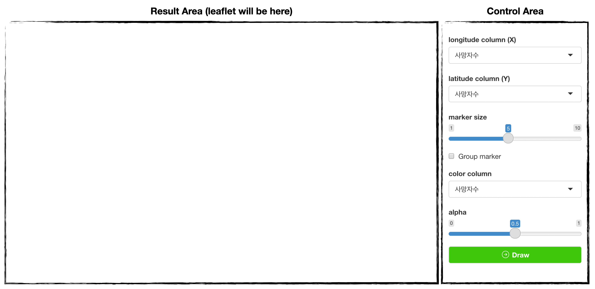
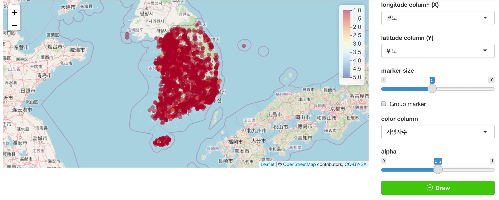
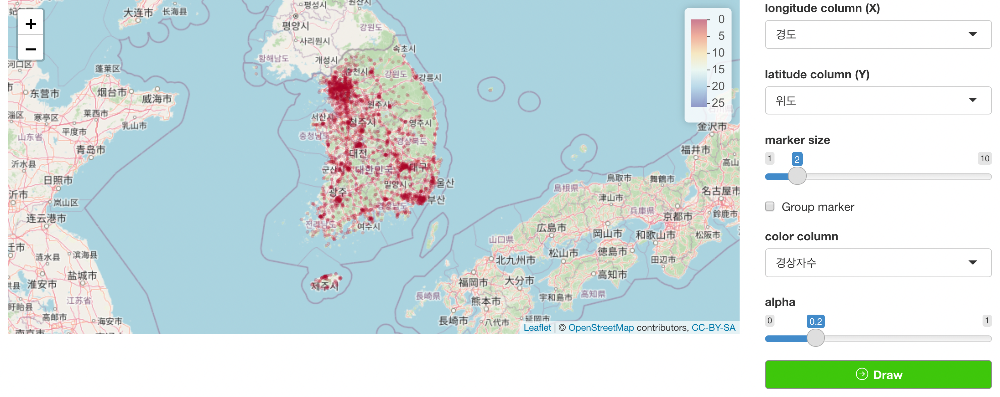
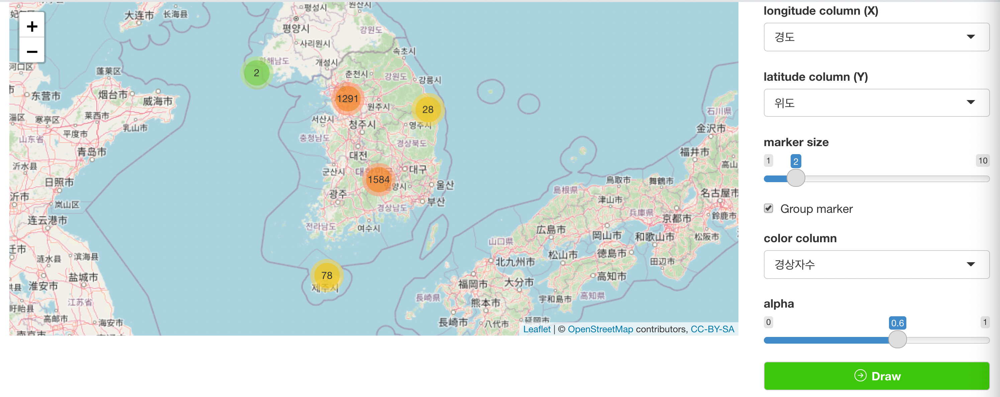

```{r, include = FALSE}
knitr::opts_chunk$set(
  collapse = TRUE,
  comment = "#>"
)
```

```{r setup}
library(colorpen)
```

## Introduction

`colorpen`'s `mapVisModule` uses [`leaflet`](https://rstudio.github.io/leaflet/) to visualize map markers with location data provided.

In this article, we'll use accident dataset of [datatoys](https://github.com/statgarten/datatoys)

This article is based on **0.0.1** Version.

## Declare module

`colorpen`'s module assumes that used in the [Shiny](https://shiny.rstudio.com/) application.

and You can use snippet(type `shinyapp`) to build very basic shiny application.

``` r
library(shiny)

ui <- fluidPage(
 
)

server <- function(input, output, session) {
  
}

shinyApp(ui, server)
```

This application will show nothing.

So let's add `mapVisModule` in **ui**

``` r
ui <- fluidPage(
  mod_mapVisModule_ui(
    id = 'MapModule'
  )
)
```

also, `mapVisModule` in **server**.

``` r
server <- function(input, output, session) {
  mod_mapVisModule_server(
    id = "MapModule",
    inputData = reactive(datatoys::accident)
  )
}
```

So final (which is very basic) code will like this.

``` r
library(shiny)

ui <- fluidPage(
  mod_mapVisModule_ui(
    id = 'MapModule'
  )
)

server <- function(input, output, session) {
  mod_mapVisModule_server(
    id = "MapModule",
    inputData = reactive(datatoys::accident) # remotes::install_github('statgarten/datatoys')
  )
}

shinyApp(ui, server) # run application
```

You should notice 2 things.

1.  both `id` in **ui** and **server** should be same.
2.  `inputData` in **server** should be format of **reactive**

## Structure of mapVisModule



mapVisModule is consisted with `Result Area` and `Control Area`

and below using flow.

1.  Declare module (we did already)
2.  Set Longitude (X) and Latitude (Y) column of data
3.  Set additional option (like marker size)
4.  [Draw]{style="color:green"}.

## Usage of mapVisModule

Let's change X and Y like image below





also you can change additional options

note that, when you use `group marker` option. `color column` and `alpha` will not make effect. (which will be modify in further version of `colorpen`)



For more information about leaflet functions, visit [this page](https://rstudio.github.io/leaflet/).

For any issue or suggestion, please make issue in [colorpen's github](https://github.com/statgarten/colorpen/issues).
